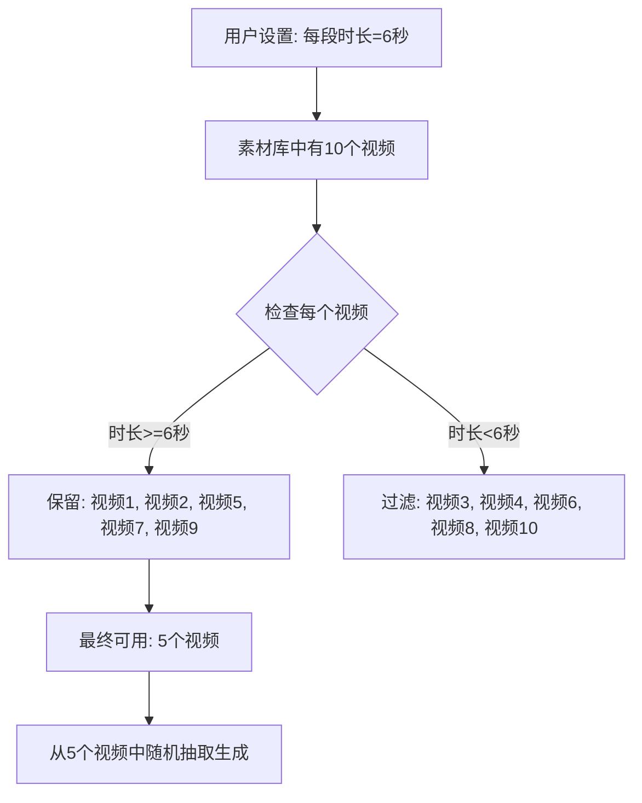

# 功能更新：过滤不符合时长要求的素材

## 新增功能

当用户从素材库中随机抽取视频时，系统会自动过滤掉时长小于用户设置的"每段时长"的视频。

## 使用场景

### 场景 1：本地素材库 - 随机抽取模式

1. 用户选择"本地素材库"作为素材来源
2. 选择"随机从素材库抽取视频"
3. 设置"视频片段时长"为 6 秒
4. 系统会自动过滤掉所有时长 < 6 秒的视频

### 场景 2：本地文件 - 手动上传

1. 用户选择"本地文件"作为素材来源
2. 手动上传视频文件
3. 设置"视频片段时长"为 6 秒
4. 系统同样会过滤掉时长 < 6 秒的视频

## 技术实现

### 修改文件：`app/services/video.py`

在 `preprocess_video` 函数中添加视频时长检查：

```python
def preprocess_video(materials: List[MaterialInfo], clip_duration=4):
    ...
    for material in materials:
        ...
        if ext in const.FILE_TYPE_IMAGES:
            # 图片素材处理逻辑（不变）
            ...
        else:
            # ✅ 新增：视频素材时长检查
            clip_duration_actual = clip.duration
            if clip_duration_actual < clip_duration:
                logger.warning(
                    f"video too short: {material_source_path}, "
                    f"duration {clip_duration_actual:.2f}s < required {clip_duration}s, skipping"
                )
                close_clip(clip)
                continue  # 跳过这个视频

            # 普通视频素材只需要读取尺寸做校验，校验完成后立即释放句柄即可。
            close_clip(clip)
            material.url = material_source_path
        
        valid_materials.append(material)

    return valid_materials
```

### 修改文件：`app/services/task.py`

添加素材过滤统计日志：

```python
def get_video_materials(task_id, params, video_terms, audio_duration, video_script=""):
    if params.video_source == "local":
        logger.info("\n\n## preprocess local materials")
        ...
        
        # ✅ 记录预处理前的素材数量
        original_material_count = len(params.video_materials)

        materials = video.preprocess_video(
            materials=params.video_materials, clip_duration=params.video_clip_duration
        )

        # ✅ 如果有素材被过滤掉，记录日志
        if materials and len(materials) < original_material_count:
            filtered_count = original_material_count - len(materials)
            logger.info(
                f"filtered out {filtered_count} material(s) that did not meet requirements "
                f"(resolution < 480x480 or duration < {params.video_clip_duration}s), "
                f"remaining: {len(materials)}"
            )

        if not materials:
            sm.state.update_task(task_id, state=const.TASK_STATE_FAILED)
            logger.error(
                "no valid materials found, please check the materials and try again."
            )
            return None
        return [material_info.url for material_info in materials]
```

## 工作流程



## 过滤规则

系统会过滤掉以下素材：

1. ❌ **分辨率不足**：宽度或高度 < 480 像素
2. ❌ **视频时长不足**：实际时长 < 用户设置的"每段时长"（新增）
3. ❌ **文件无法读取**：损坏或格式不支持的文件

通过以下检查的素材才会被使用：

1. ✅ **分辨率合格**：宽度和高度 ≥ 480 像素
2. ✅ **视频时长足够**：实际时长 ≥ 用户设置的"每段时长"
3. ✅ **文件可读取**：格式正确，未损坏

## 日志输出示例

### 示例 1：有素材被过滤

```log
## preprocess local materials
video too short: /path/to/video3.mp4, duration 3.50s < required 6s, skipping
video too short: /path/to/video4.mp4, duration 4.20s < required 6s, skipping
low resolution material: 320x240, minimum 480x480 required
filtered out 3 material(s) that did not meet requirements (resolution < 480x480 or duration < 6s), remaining: 7
```

### 示例 2：所有素材都符合要求

```log
## preprocess local materials
[正常处理所有素材...]
```

### 示例 3：所有素材都被过滤（错误场景）

```log
## preprocess local materials
video too short: /path/to/video1.mp4, duration 2.50s < required 6s, skipping
video too short: /path/to/video2.mp4, duration 3.00s < required 6s, skipping
video too short: /path/to/video3.mp4, duration 4.50s < required 6s, skipping
no valid materials found, please check the materials and try again.
```

## 使用建议

### 1. 素材库准备

在素材库中添加视频时，建议：

- ✅ 上传时长 ≥ 8 秒的视频（留有余量）
- ✅ 混合不同时长的视频（如 10s、15s、20s）
- ✅ 确保视频分辨率 ≥ 480x480

### 2. 片段时长设置

设置"视频片段时长"时，建议：

- ✅ 根据素材库中最短视频的时长来设置
- ✅ 如果素材库视频普遍较短（如 5-8 秒），设置为 4-5 秒
- ✅ 如果素材库视频较长（如 10-20 秒），可以设置为 6-8 秒

### 3. 避免素材全部被过滤

- ❌ 不要设置过大的"每段时长"（如 10 秒），除非素材库视频都很长
- ✅ 生成前检查日志，确认有足够的可用素材
- ✅ 如果提示"no valid materials found"，降低"每段时长"或添加更长的视频

## 与其他功能的配合

### 1. 与"根据视频时长生成文案"功能的配合

```python
# 场景：用户从素材库随机抽取
# 1. 素材库中有 10 个视频
# 2. 用户设置"每段时长"为 6 秒
# 3. 系统过滤后剩余 7 个视频（3 个被过滤）
# 4. 系统计算：7 × 6 = 42 秒
# 5. AI 生成约 42 秒的文案
```

⚠️ **注意**：从素材库随机抽取时，过滤后的素材数量可能少于预期，导致：
- 可用素材数量减少
- 计算的目标文案时长也会相应减少

### 2. 与"按我选择的素材生成"模式的配合

- 在"按我选择的素材生成"模式下，用户手动选择素材
- 系统仍会过滤不符合要求的素材
- 如果选择的素材被过滤，会在日志中看到警告

## 错误处理

### 场景 1：所有素材都被过滤

**错误信息**：
```
no valid materials found, please check the materials and try again.
```

**解决方法**：
1. 降低"视频片段时长"设置（如从 10 秒改为 5 秒）
2. 添加更长时长的视频到素材库
3. 检查素材库中视频的实际时长

### 场景 2：大部分素材被过滤

**日志提示**：
```
filtered out 8 material(s) ..., remaining: 2
```

**建议**：
- 如果剩余素材太少（如 < 3 个），可能导致视频重复性高
- 考虑降低"视频片段时长"或添加更多符合要求的素材

## 版本信息

- **修改日期**：2026-07-03
- **影响文件**：
  - `app/services/video.py` - 添加视频时长检查
  - `app/services/task.py` - 添加过滤统计日志
- **向后兼容**：✅ 是
- **相关功能**：配合"根据视频时长生成文案"功能使用

## 总结

此功能确保：

1. ✅ 只使用时长足够的视频素材
2. ✅ 避免视频片段被强制截断或重复循环
3. ✅ 提升最终视频的质量和流畅度
4. ✅ 给用户清晰的反馈（哪些素材被过滤，为什么）

配合"根据视频时长生成文案"功能，实现：
- **上传本地素材 → 过滤不符合要求的 → 计算总时长 → 生成匹配时长的文案 → 完美合成视频** ✨
