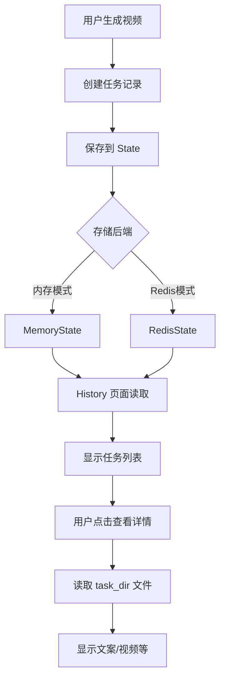

# 生成历史功能文档

## 功能描述

用户可以查看所有历史生成记录，包括任务状态、生成内容、视频文件等详细信息。

## 功能特点

### 1. **历史记录列表**
- 显示所有任务的卡片列表
- 任务卡片包含：
  - 视频主题
  - 任务ID
  - 创建时间
  - 任务状态（排队中/处理中/已完成/失败）
  - 进度条（处理中的任务）
- 支持分页浏览（每页10条）
- 按创建时间倒序排列（最新的在前）

### 2. **任务详情页**
点击"查看详情"后可以看到：
- **基本信息**：状态、进度、创建时间
- **生成的文案**：完整的视频文案内容
- **关键词**：生成视频使用的搜索关键词
- **生成的视频**：最多显示3列视频预览
- **操作按钮**：
  - 📁 打开文件夹：直接打开任务的文件目录
  - 🗑️ 删除任务：删除任务记录（需二次确认）

### 3. **任务状态**
系统支持4种任务状态：
- 🟡 **排队中**（状态码：0）
- 🟡 **处理中**（状态码：1）- 显示进度条
- 🟢 **已完成**（状态码：2）
- 🔴 **失败**（状态码：3）

## 技术实现

### 文件结构

```
webui/
└── pages/
    └── History.py          # 新增的历史页面
```

### 1. 创建历史页面 (`webui/pages/History.py`)

这是一个完整的 Streamlit 多页面应用的子页面：

```python
# 主要功能模块：
1. render_task_card(task)           # 渲染任务列表卡片
2. render_task_detail(task_id)      # 渲染任务详情页
3. load_task_details(task_id)       # 加载任务文件（script.json, 视频等）
4. get_task_status_display(state)   # 获取状态显示文本和样式
5. format_timestamp(timestamp)      # 格式化时间戳
```

### 2. 修改任务管理 (`app/services/task.py`)

在 `start` 函数中添加任务元数据保存：

```python
def start(task_id, params: VideoParams, stop_at: str = "video"):
    logger.info(f"start task: {task_id}, stop_at: {stop_at}")

    # ✅ 保存任务的基本信息和创建时间
    import time
    sm.state.update_task(
        task_id,
        state=const.TASK_STATE_PROCESSING,
        progress=5,
        video_subject=params.video_subject,  # 保存视频主题
        create_time=int(time.time()),        # 保存创建时间戳
    )
```

### 3. 状态管理 (`app/services/state.py`)

利用现有的状态管理系统：
- `get_all_tasks(page, page_size)` - 获取任务列表（支持分页）
- `get_task(task_id)` - 获取单个任务详情
- `update_task(task_id, **kwargs)` - 更新任务信息
- `delete_task(task_id)` - 删除任务记录

支持两种存储后端：
- **MemoryState**：内存存储（默认）
- **RedisState**：Redis 持久化存储

## 使用方法

### 访问历史页面

1. 启动 MoneyPrinterTurbo WebUI
2. 在侧边栏或页面顶部选择 **"History"** 页面
3. 查看所有历史生成任务

### 查看任务详情

1. 在历史列表中点击任意任务的 **"查看详情"** 按钮
2. 查看文案、关键词、视频等详细信息
3. 点击 **"← 返回列表"** 返回列表页

### 打开任务文件夹

1. 在任务详情页点击 **"📁 打开文件夹"**
2. 系统会打开任务目录，包含所有生成的文件：
   - `script.json` - 文案和关键词
   - `audio.mp3` - 音频文件
   - `subtitle.srt` - 字幕文件
   - `final-1.mp4`, `final-2.mp4`, ... - 生成的视频
   - `combined-1.mp4`, ... - 合成的素材视频

### 删除任务

1. 在任务详情页点击 **"🗑️ 删除任务"**
2. 再次点击确认删除
3. 任务记录将从系统中移除（文件仍保留在磁盘上）

## 页面设计

### 样式特点

继承主页面的 Creative Studio 设计系统：
- 🎨 **卡片式布局**：清晰的视觉层次
- 🌊 **Teal-Indigo 配色**：与主页面一致
- ✨ **悬停效果**：卡片提升动画
- 🎯 **状态徽章**：颜色编码的状态指示
- 📱 **响应式设计**：适配不同屏幕尺寸

### 空状态设计

当没有历史记录时显示：
```
📭
还没有生成历史
前往主页开始生成第一个视频吧！
```

## 数据流程



## 文件存储位置

任务文件存储在：
```
storage/tasks/{task_id}/
├── script.json          # 文案和关键词
├── audio.mp3           # 合成的音频
├── subtitle.srt        # 字幕文件
├── combined-1.mp4      # 合成的素材视频
├── final-1.mp4         # 最终生成的视频
├── final-2.mp4         # (如果生成多个)
└── ...
```

## 配置选项

### 启用 Redis 持久化（可选）

在 `config.toml` 中配置：

```toml
[app]
enable_redis = true
redis_host = "localhost"
redis_port = 6379
redis_db = 0
redis_password = ""  # 如果有密码
```

启用 Redis 后，任务记录会持久化保存，重启应用后仍然可见。

### 分页设置

当前默认每页显示 10 条记录，可在代码中修改：

```python
# webui/pages/History.py
page_size = 10  # 修改这里
```

## 注意事项

### 1. 任务ID格式

任务ID通常以时间戳开头，格式如：
```
1735084800-abc123
```

系统会尝试从任务ID中提取创建时间。

### 2. 任务记录 vs 文件

- **删除任务记录**：只删除 State 中的元数据
- **文件保留**：磁盘上的视频文件不会被删除
- 如需彻底删除，请手动删除 `storage/tasks/{task_id}/` 目录

### 3. 内存模式限制

使用默认的 MemoryState 时：
- ❌ 重启应用后历史记录会丢失
- ✅ 文件仍然保留在磁盘上
- 💡 建议启用 Redis 以持久化保存记录

### 4. 性能考虑

- 大量任务时，分页可以减少内存占用
- Redis 模式下，使用 SCAN 命令避免阻塞
- 任务详情页只在需要时才加载视频文件

## 扩展功能建议

### 1. 搜索和过滤
```python
# 未来可以添加：
- 按视频主题搜索
- 按状态过滤（只看已完成/失败的）
- 按日期范围筛选
```

### 2. 批量操作
```python
# 未来可以添加：
- 批量删除任务
- 批量导出视频
- 批量重新生成
```

### 3. 统计信息
```python
# 未来可以添加：
- 总生成次数
- 成功率统计
- 平均生成时间
- 最常用的主题/关键词
```

### 4. 任务标签
```python
# 未来可以添加：
- 为任务添加自定义标签
- 按标签分类管理
- 标签云展示
```

## 版本信息

- **添加日期**：2026-07-03
- **新增文件**：
  - `webui/pages/History.py` - 历史页面
- **修改文件**：
  - `app/services/task.py` - 添加任务元数据保存
- **依赖**：
  - 现有的 `app/services/state.py`
  - 现有的 `app/utils/utils.py`
- **向后兼容**：✅ 是

## 常见问题 (FAQ)

### Q: 为什么看不到历史记录？

A: 检查以下几点：
1. 是否已经生成过视频？
2. 是否使用了内存模式且重启了应用？
3. 如需持久化，请启用 Redis

### Q: 删除任务后文件还在吗？

A: 是的，删除任务只删除记录，文件仍在 `storage/tasks/{task_id}/` 目录中。

### Q: 如何恢复删除的任务记录？

A: 任务记录删除后无法恢复，但文件仍在，可以手动查看。

### Q: 历史页面在哪里？

A: Streamlit 会自动将 `webui/pages/` 目录下的文件作为子页面，在侧边栏或顶部可以看到 "History" 页面。

## 总结

生成历史功能让用户可以：
1. ✅ 查看所有历史任务
2. ✅ 了解任务状态和进度
3. ✅ 查看生成的文案和视频
4. ✅ 方便地管理历史记录
5. ✅ 快速访问任务文件

配合 Redis 使用可以实现持久化存储，确保历史记录不丢失！ 🎉
